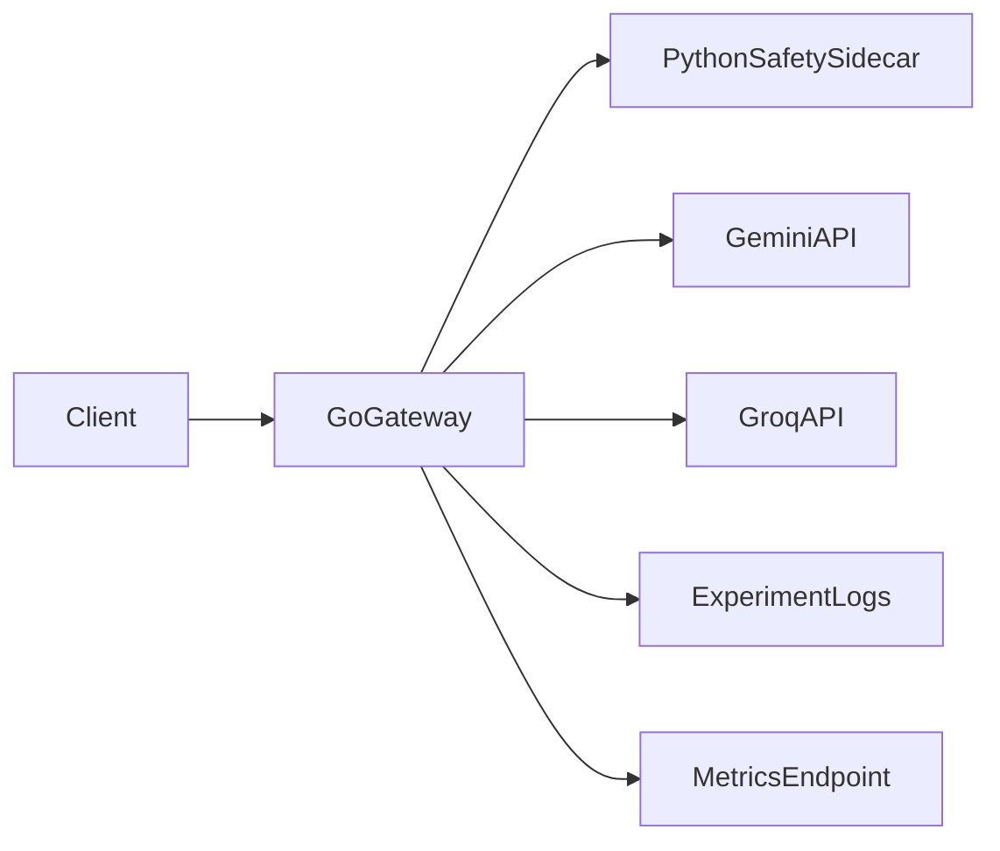

# Roadmap: Build the LLM Gateway by Phases

This roadmap follows the recommended learning path:

- Approach 2 architecture (Go gateway + Python sidecar)
- Build in incremental phases
- Capture major decisions as ADRs

Read `00-project-bootstrap.md` before starting phase 1.

## Final target architecture



## Phase sequence

1. Thin gateway (single provider, baseline contract)
2. API key auth + rate limiting
3. Safety checks in-process
4. Split safety into sidecar service
5. Multi-provider adapters + routing
6. Resilience (timeouts/retries/circuit breakers)
7. Observability and replay-based evaluations

## File/folder creation rule

Create files only when their phase starts. This prevents premature complexity and keeps the learning path clean.

## Learning goals per phase

- **Phase 1:** Request lifecycle, clean handler boundaries, config loading
- **Phase 2:** Middleware chaining, tenant-level controls
- **Phase 3:** Safety policy modeling and deterministic enforcement
- **Phase 4:** Service decomposition and inter-service contracts
- **Phase 5:** Adapter pattern + routing policy design
- **Phase 6:** Failure handling and graceful degradation
- **Phase 7:** Operational maturity and quality loops

## Folder blueprint you should create on implementation laptop

```text
llm-gateway/
  gateway/
    cmd/main.go
    internal/
      handlers/chat.go
      middleware/auth.go
      middleware/ratelimit.go
      providers/gemini.go
      providers/groq.go
      router/model_router.go
      safety/client.go
      circuit/breaker.go
      logger/experiment_log.go
  safety_sidecar/
    main.py
    detectors/
      injection.py
      jailbreak.py
      pii.py
  config/
    config.yaml
  logs/
    experiment_log.jsonl
```

## Definition of done (program-level)

- One stable `POST /v1/chat` interface regardless of provider
- Safety verdict enforced before provider call
- Key-level auth and rate limits
- Provider fallback with circuit breaking
- Structured logs + metrics + replay scripts
- ADRs updated with your final choices
