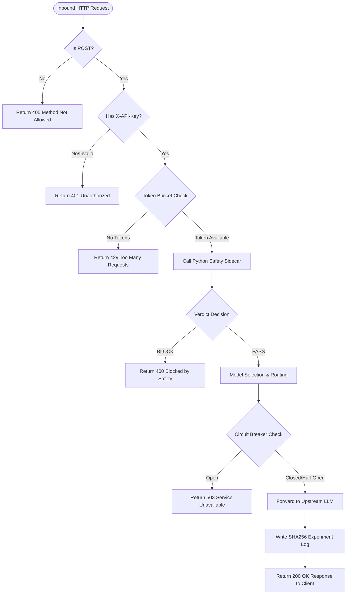
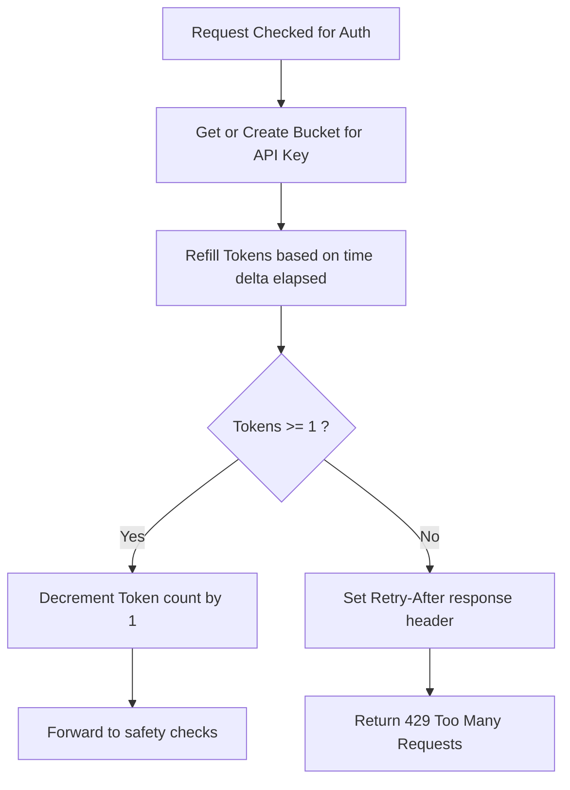
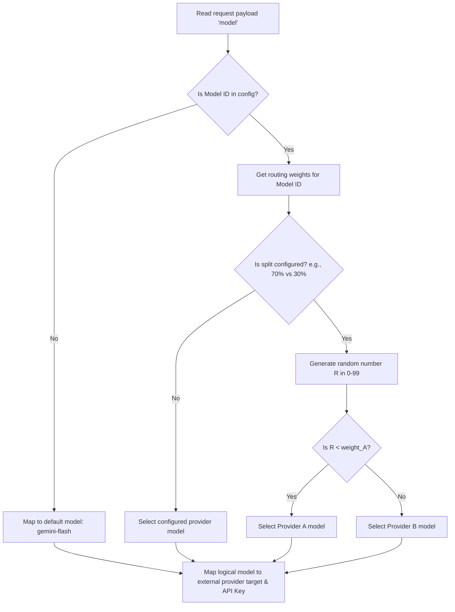
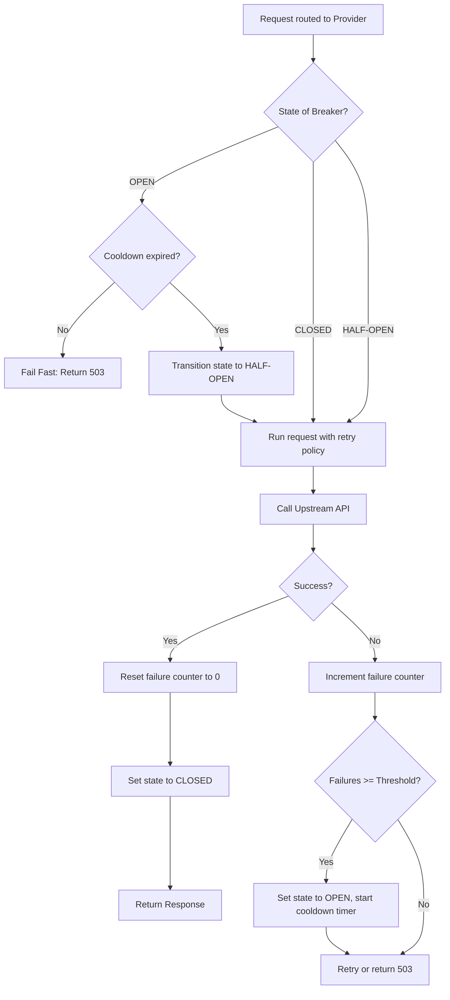
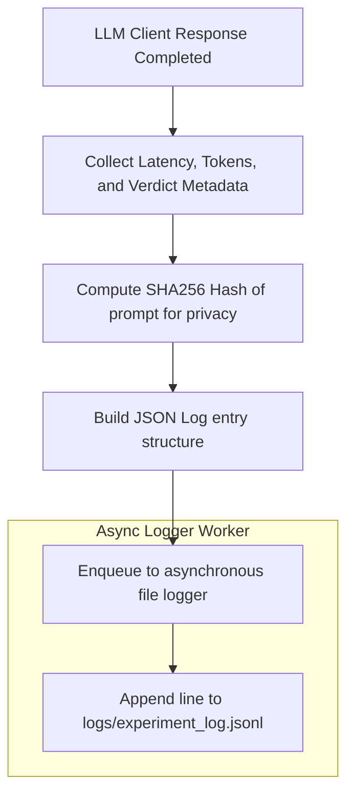
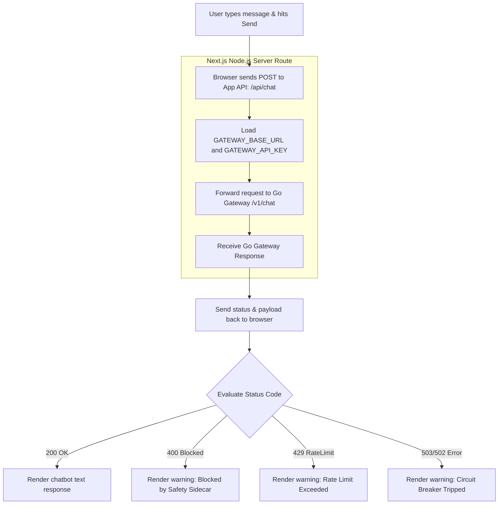

# LLM Gateway — Functionality Flowcharts & Architecture Docs

This document maps out the detailed execution flows for every core feature inside the **LLM Gateway** project.

---

## 1. Request Lifecycle & Middleware Chain
Every request arriving at `/v1/chat` goes through a strict sequence of middlewares before routing to the LLM backend.

* **Code references:** [server.go](file:///Users/mast/Documents/VInayPrograming/LLM_GateWay/llm-gateway/gateway/cmd/main.go) (setup), [auth.go](file:///Users/mast/Documents/VInayPrograming/LLM_GateWay/llm-gateway/gateway/internal/middleware/auth.go), [ratelimit.go](file:///Users/mast/Documents/VInayPrograming/LLM_GateWay/llm-gateway/gateway/internal/middleware/ratelimit.go)



---

## 2. API Key Auth & Rate Limiting (Token Bucket)
Limits incoming traffic per API key using an in-memory token bucket.

* **Code references:** [auth.go](file:///Users/mast/Documents/VInayPrograming/LLM_GateWay/llm-gateway/gateway/internal/middleware/auth.go), [ratelimit.go](file:///Users/mast/Documents/VInayPrograming/LLM_GateWay/llm-gateway/gateway/internal/middleware/ratelimit.go)



---

## 3. Safety Sidecar Orchestration (FastAPI)
Performs multi-layered threat analysis. Runs rule-based scanning, PII masking, and LLM-as-a-Judge jailbreak checking.

* **Code references:** [main.py](file:///Users/mast/Documents/VInayPrograming/LLM_GateWay/llm-gateway/safety_sidecar/main.py), [injection.py](file:///Users/mast/Documents/VInayPrograming/LLM_GateWay/llm-gateway/safety_sidecar/detectors/injection.py), [pii.py](file:///Users/mast/Documents/VInayPrograming/LLM_GateWay/llm-gateway/safety_sidecar/detectors/pii.py), [jailbreak.py](file:///Users/mast/Documents/VInayPrograming/LLM_GateWay/llm-gateway/safety_sidecar/detectors/jailbreak.py)

```mermaid
flowchart TD
    Recv[POST /analyze { prompt }] --> Layer1{Regex Injection Check}
    
    Layer1 -- Match Found --> BlockRegex[Immediate BLOCK: injection]
    
    Layer1 -- No Match --> RunAsync[Run Parallel Detectors]
    
    subgraph Parallel Safety Checks
        RunAsync --> DetectorPII[Microsoft Presidio PII Scanner]
        RunAsync --> DetectorLLM[LLM Zero-Shot Jailbreak Judge]
    end
    
    DetectorPII --> PIIVerdict{PII Found?}
    PIIVerdict -- Yes --> MaskPrompt[Replace PII with REDACTED]
    PIIVerdict -- No --> KeepPrompt[Keep Original Prompt]
    
    DetectorLLM --> LLMVerdict{Jailbreak Score >= 0.5?}
    LLMVerdict -- Yes --> BlockLLM[BLOCK: jailbreak]
    LLMVerdict -- No --> PassChecks[PASS safety check]
    
    BlockRegex --> ResponseBlock[Return verdict: BLOCK]
    BlockLLM --> ResponseBlock
    
    MaskPrompt --> CombineResult
    KeepPrompt --> CombineResult
    PassChecks --> CombineResult
    
    CombineResult --> ResponsePass[Return verdict: PASS with masked_prompt]
```

---

## 4. Model Selection & A/B Routing
Determines which backend model and API to target, supporting static target mapping or weighted A/B split.

* **Code reference:** [model_router.go](file:///Users/mast/Documents/VInayPrograming/LLM_GateWay/llm-gateway/gateway/internal/router/model_router.go)



---

## 5. Upstream Resilience & Circuit Breaker
Protects the gateway from getting stuck on failing upstream providers (Gemini or Groq) by failing fast and applying exponential backoffs.

* **Code references:** [breaker.go](file:///Users/mast/Documents/VInayPrograming/LLM_GateWay/llm-gateway/gateway/internal/circuit/breaker.go), [resilience.go](file:///Users/mast/Documents/VInayPrograming/LLM_GateWay/llm-gateway/gateway/internal/providers/resilience.go)



---

## 6. Structured Experiment Logging
Logs request-response telemetry asynchronously without saving sensitive prompt details (hashes them).

* **Code reference:** [experiment_log.go](file:///Users/mast/Documents/VInayPrograming/LLM_GateWay/llm-gateway/gateway/internal/logger/experiment_log.go)



---

## 7. Next.js Showcase UI Flow
Describes how the user interface safely communicates with the gateway using server-side Next.js route proxies to hide API secrets.

* **Code reference:** [showcase_ui_improved](file:///Users/mast/Documents/VInayPrograming/LLM_GateWay/showcase_ui_improved) (Next.js app structure)


